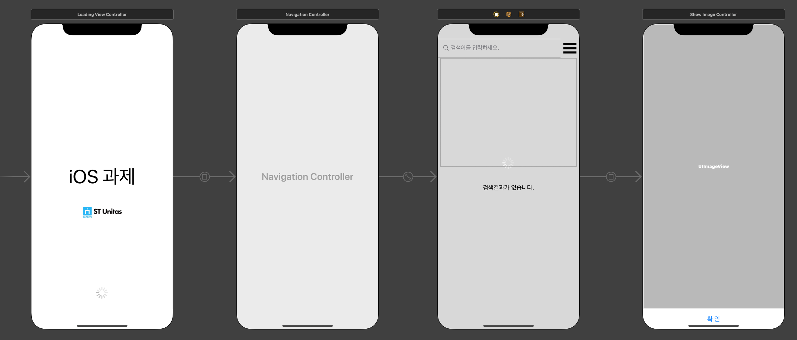
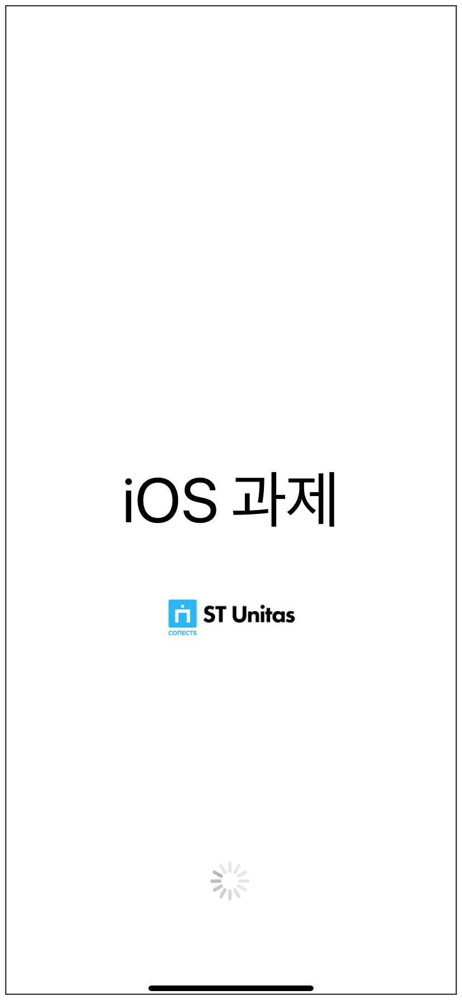

# ST_Unitas_iOS    
- 필수 구현 목표  
필수 구현 목표와 제한 사항은 반드시 지켜야 하며, 그 외는 자유롭게 구현이 가능합니다.  
사용자가 검색어를 입력하고 이미지 검색 결과를 화면에 표시하는 어플리케이션을 만들어야 합니다.  
다음 이미지 검색 API 를 사용하여 개발해야 합니다. (API 키는 본인이 직접 발급 받으셔야 합니다.  
https://developers.kakao.com/docs/restapi/search#%EC%9D%B4%EB%AF%B8%EC%A7%80-%EA%B2%80%EC%83%89  
검색 결과는 JSON 형식으로 사용해야 합니다.  
검색어 필드는 상단에 위치해야 합니다.  
검색 버튼은 없어야 하며, 1초 이상 검색어 입력이 없을 경우 검색 작업을 수행합니다.  
검색 결과가 없거나 오류가 발생했을 경우 사용자에게 알려야 합니다.  
검색 결과 이미지는 원본의 가로 세로 비율을 유지하여야 하며 이미지의 가로 사이즈는 화면 폭과 동일해야 합니다.  
페이징을 구현해야 합니다.  
Loading 중일 때 Loading 을 나타낼 수 있는 Indicator (Progress) 를 노출해야합니다.    
- 제한 사항  
사용 언어 : Swift.  
사용 필수 라이브러리 : Kingfisher, Alamofire  
Auto Layout 사용.    
- 추가 구현 목표  
RxSwift 사용.  
아키텍처 적용 (ex: MVVM, VIPER, Clean Architecture, etc.)  
Unit Test 적용.  
UITableView/UICollectionView prefetching 사용    
- 화면 레이아웃  
 
- 스크린샷  
<table>
  <tr>  
      <td>
        
      </td>
    <td>
        
      </td>
    <td>
        
      </td>
  </tr>
  <tr>  
      <td>
        초기화면
      </td>
    <td>
       리스트 화면 검색 결과
      </td>
    <td>
        collection 화면 검색 결과
      </td>
  </tr>
</table>
<table>
  <tr>  
      <td>
        
      </td>
    <td>
        
      </td>
    <td>
        
      </td>
  </tr>
  <tr>  
      <td>
        항목 클릭시 웹 페이지로 이동
      </td>
    <td>
       항목에서 왼쪽 이미지 아이콘 클릭시 이미지 전체보기로 이동
      </td>
    <td>
        항목 왼쪽 이미지 Kingfisher 라이브러리 사용 및 스크롤시 페이징 기능 적용 
      </td>
  </tr>
</table>
